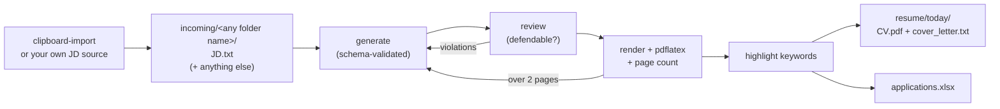

# Job Stitch

Stitch a job description together with your career history and get back a
tailored, two-page LaTeX CV and a cover letter.

You keep one **master profile** — everything you have ever done, far too long
for a real CV. For each job description, jobstitch selects from it, rewrites
the summary for the target role, enforces a two-page limit by actually
compiling the PDF and counting pages, reviews the result against your profile
for things you cannot defend in an interview, and logs the application to a
spreadsheet.

It talks to any **OpenAI-compatible endpoint**. Which models it uses is
configuration, not code: see [`resources/models.toml`](resources/models.toml).

📄 **[Sample output](examples/sample_cv.pdf)** — generated from the fictional
profile shipped in this repo, no API key required to look at it.

---

## How it works



Two processes, joined by a folder:

1. **`clipboard-import`** watches your clipboard. Copy a job posting, it
   confirms the text really is one, analyses it against your profile and
   preferences (match %, salary, work mode, gaps, a preference score), shows
   you the result, and on your OK publishes a job folder.
2. **`job-watcher`** picks up job folders and runs the generation pipeline in
   a pool of worker threads, one isolated directory per job.

The generation loop is the interesting part:

- **Generate** structured CV data, validated against a Pydantic schema. A
  schema violation is fed back to the model as a correction turn rather than
  raising.
- **Review** the draft against your master profile with a second pass that
  looks for unearned seniority, unsupported technologies and internal
  contradictions — the "could you defend this in an interview?" test.
  Violations are fed back and the CV is regenerated.
- **Render** to LaTeX, compile with `pdflatex`, and count the pages of the
  real PDF. Over two pages, the overflow is measured in lines and turned into
  a specific instruction ("remove 2 bullet points, cut 400 characters") that
  goes back to the model.
- **Highlight** keywords with the mid-size `highlight` model, as a final pass
  over already validated data, then re-render.

Successful jobs move to `resume/<today>/`, keeping everything that came in
with them, and append a row to `applications.xlsx` (turn that off with
`--no-xlsx` or `JOBSTITCH_XLSX=off`; if the spreadsheet cannot be written the
CV is still delivered and the problem is logged). Failures move to `error/`
with a `job.log` holding the traceback; move the folder back to `incoming/` to
retry.

## Requirements

- Python 3.12+ and [uv](https://docs.astral.sh/uv/)
- `pdflatex` with `hyperref`, `graphicx`, `array`, `hhline`, `babel`,
  `fontawesome5` and Type 1 CM fonts — on Debian/Ubuntu:
  `sudo apt install texlive-latex-base cm-super texlive-fonts-extra`
  (`fontawesome5` is only in that last one, which is 1.7 GB — or let
  [Docker](#docker) bring its own LaTeX instead)
- An API key for at least one OpenAI-compatible provider

## Quick start

```bash
git clone https://github.com/gcontini/jobstitch && cd jobstitch
uv sync                      # creates .venv/ and installs the console scripts

cp .env.example .env         # then fill in one provider's API key
```

Put your own details in place of the shipped fictional ones:

```bash
cd resources
cp candidate_profile.example.json  candidate_profile.json
cp candidate_data.example.json     candidate_data.json
cp pers_preferences.example.md     pers_preferences.md
cp candidate_signature.example.png candidate_signature.png   # optional
```

Those four filenames are **git-ignored**, so your real data cannot be
committed by accident. Until you create them jobstitch falls back to the
`*.example.*` files and says so on every run, which means a fresh clone
produces a complete (fictional) CV before you have typed anything.

Then run the two processes in separate terminals:

```bash
uv run job-watcher           # leave running
uv run clipboard-import      # copy a job posting; follow the prompts
```

`clipboard-import` asks you to paste the posting URL, or `y` to submit
without one, `s` to skip, `q` to quit. Ctrl+C stops the watcher; in-flight
jobs stay in `working/` and are re-queued next start.

### What goes where

| File | Contains |
|---|---|
| `candidate_profile.json` | Your full career history — the master profile the LLM selects from. The long one. |
| `candidate_data.json` | Contact block rendered verbatim into the CV header: name, email, phone, LinkedIn. |
| `pers_preferences.md` | What *you* want from a job, scored per posting into `pers_preference_score`. |
| `candidate_signature.png` | Signature image placed at the foot of the CV. |

The master profile has one non-obvious field: `summaries` is a list of example
profile paragraphs, with `<<job_title>>` where the target role goes. They are
style exemplars, not templates — the model writes a new summary in their
register. `writing_style` (optional) is a free-text instruction the CV,
cover-letter prompts both honour; set it to control voice and register
without editing prompt files.

## Docker

One image, both processes, and one folder of yours mounted at `/data`:

```bash
cp .env.example .env              # fill in one provider's API key
docker build -t jobstitch .
docker run -it --rm --env-file .env \
    --user "$(id -u):$(id -g)" \
    -v /path/to/jobstitch-data:/data \
    -v /tmp/.X11-unix:/tmp/.X11-unix:ro -e DISPLAY \
    jobstitch
```

Or, with the same flags already written down for you (requires Docker Compose plugin):

```bash
docker compose run --rm jobstitch
```

**Docker Compose plugin:** `docker compose` is a CLI plugin, not a `docker
plugin`. On some systems it is packaged separately — on Debian/Ubuntu:

```bash
sudo apt install docker-compose-plugin
```

### Clipboard over SSH

If you work on the machine over `ssh -X`, `DISPLAY` is something like
`localhost:10.0`: a TCP port on the **host's** loopback, not the socket in
`/tmp/.X11-unix`. A bridged container's loopback is its own, so it cannot
reach that display — `xclip` fails, `pyperclip` turns the failure into an
empty string, and the intake loop sits there reporting `0 chars` forever,
never seeing a copy. The container needs the host's network namespace *and*
your magic cookie — either one alone still cannot open the display. In
`.env`:

```bash
JOBSTITCH_NETWORK=host
JOBSTITCH_XAUTHORITY=$HOME/.Xauthority   # absolute path; compose won't expand ~
```

Or, with plain `docker run`:

```bash
docker run -it --rm --env-file .env --network host \
    --user "$(id -u):$(id -g)" \
    -v /path/to/jobstitch-data:/data \
    -e DISPLAY -e XAUTHORITY=/tmp/.Xauthority \
    -v "$HOME/.Xauthority:/tmp/.Xauthority:ro" \
    jobstitch
```

Check it from inside before blaming the model — this should print what you
last copied:

```bash
docker compose run --rm --entrypoint xclip jobstitch -selection c -o
```

`clipboard-import` probes the display at startup and tells you when it
cannot reach one, rather than waiting in silence.

The mounted folder holds everything that is yours:

```
jobstitch-data/
    applications_cv/   incoming, working, error, resume, applications.xlsx
    resources/         templates, prompts, models.toml, your CV data
```

Both are created on first launch, and `resources/` is **seeded from the copy
baked into the image**: a file you do not have yet is copied in, a file you
already have is never touched. So your `candidate_profile.json` and your
edited prompts live next to your applications, and survive every rebuild.

| | |
|---|---|
| Keys | `--env-file .env` at launch — nothing is baked into the image. A `.env` inside the mounted folder is read too; what you pass at launch wins. |
| Terminal | `-it`, because `clipboard-import` asks you about each posting it finds. |
| Clipboard | It drives `xclip` (or `wl-clipboard`) inside the container, so pass the host's X11 socket as above — on Wayland, `WAYLAND_DISPLAY` and its socket instead (see [`compose.yaml`](compose.yaml)). Over `ssh -X`, the socket is not enough: see [Clipboard over SSH](#clipboard-over-ssh). |
| Ownership | `--user "$(id -u):$(id -g)"`, so the CVs and the spreadsheet belong to you rather than to root. |

Quitting the intake loop with `q` leaves the watcher running; the container
stops when the watcher does. To start another intake session against the same
container:

```bash
docker exec -it <container> clipboard-import
```

On a machine with no clipboard — a server fed by your own JD source —
`JOBSTITCH_CLIPBOARD=off` runs the watcher alone. Watcher flags still work:
`docker run ... jobstitch start-all.sh --temperature=0.4`.

The image is `python:3.12-slim` plus the LaTeX packages the template needs
(about 780 MB). `fontawesome5` is vendored in
[`docker/vendor/`](docker/vendor/) rather than pulled from Debian's 1.7 GB
`texlive-fonts-extra` — the build reaches no network to install it; see
[`docker/vendor/README.md`](docker/vendor/README.md) for provenance and how
to refresh it.

## Bring your own JD source

`clipboard-import` is one way in, not the only one. The contract between a JD
source and the pipeline is one file in a folder:

```
$JOBSTITCH_HOME/incoming/<any folder name>/
    JD.txt          the raw job description text — this is the contract
```

A non-empty `JD.txt` is all the watcher requires, and the only file it reads.
Anything that writes one is a valid source — a scraper, a job-board API
client, a shell script, a colleague dropping a file in. Write into a hidden
`.tmp_*` folder and rename it into place so the watcher only ever sees
complete folders.

**The folder name means nothing to the watcher.** It is carried through to
`resume/<today>/` unchanged and never parsed, so name it whatever you like;
`Company_JobTitle` is a convention for your own eyes when you go looking
through the output.

**Whatever else you put in the folder comes along.** The watcher deletes only
the LaTeX leftovers of its own run (`.aux`, `.log`, `.out`, and its scratch
subfolders) and moves everything else on to `resume/<today>/` next to the CV.
So a source can leave its own notes, screenshots or metadata in there and find
them again with the finished CV.

Sources live in [`src/jd_sources/`](src/jd_sources/), outside the `jobstitch`
package: they import the pipeline, the pipeline never imports them.

### The optional `analysis.json`

`clipboard-import` also writes an `analysis.json` — the
[`JDAnalysis`](src/jobstitch/jd_validator.py) Pydantic model, its reading of
the posting against your profile (match %, salary, work mode, gaps, a
preference score). It is optional everywhere: nothing fails without it, and
the watcher never looks at it. Two parts of the pipeline use it when it
happens to be there:

- the **cover letter** takes the company, the skills and the gaps from it as
  extra context, and is written from `JD.txt` alone when it is absent;
- the **spreadsheet** fills its `webLink` column from `posting_url`, and
  leaves the column empty when it is absent.

To produce one from raw text:

```python
from jobstitch import JDValidator
analysis = JDValidator().analyze_jd(jd_text)
```

## Configuration

### Models

jobstitch calls **three models**, one per job, all declared in
[`resources/models.toml`](resources/models.toml):

| Model | Does | Wants to be |
|---|---|---|
| `summary` | Decides whether the clipboard holds a job description, extracts the JD analysis, writes the cover letter | Mid-size, light thinking, web search |
| `cv` | Writes the tailored CV and reviews it | The large one, thinking with a budget |
| `highlight` | Adds the `**bold**`/`*italic*` keyword markers to already-validated CV data | Mid-size, no thinking |

Each table is self-contained — endpoint, credentials, model name and
generation settings — and nothing about a provider is hardcoded: provider
differences are **capability flags**, not name checks in the code.

```toml
[models.cv]
model             = "qwen-max"
api_key_env       = "DASHSCOPE_API_KEY"
base_url_env      = "DASHSCOPE_BASE_URL"
base_url          = "https://dashscope-intl.aliyuncs.com/compatible-mode/v1"
structured_output = "json_object"
thinking          = "on"
thinking_budget   = 6000
```

| Key | Meaning |
|---|---|
| `structured_output` | `json_schema_strict`, `json_schema`, `json_object` or `none`. The schema is also restated in the prompt and every reply is validated, so `json_object` works fine. |
| `thinking` | `"auto"` sends no thinking switch (the provider decides — the right value for endpoints that reject one, e.g. OpenAI), `"on"` enables it, `"off"` forces it off. Mechanical passes need `"off"`: a hybrid-reasoning model asked to bold keywords otherwise spends the whole output budget thinking and returns truncated JSON. |
| `thinking_budget` | Cap on reasoning tokens per call, with `thinking = "on"`. |
| `reasoning_effort` | `"low"`, `"medium"` or `"high"`; dropped automatically where the provider cannot take it — including whenever `thinking_budget` is set, since the two are mutually exclusive. |
| `web_search` | The endpoint runs web search server-side. Used to research the employer for the cover letter, and only for a direct posting from a named company. |
| `temperature` | Sampling temperature; omit for the provider default. |

The three models can sit on three different providers or all on one. A model
whose API key is not set borrows the endpoint and model name of one that is —
saying so at startup — so a single provider key is enough to run everything.

The `[models.*]` tables are the whole model configuration; the CLI only tunes
sampling for CV writing:

```bash
uv run job-watcher --temperature=0.4 --frequency-penalty=0.1
```

### Prompts

The system prompts in `resources/` are meant to be edited — they encode
opinions about CV writing, not mechanics:

| File | Role |
|---|---|
| `sys_prompt_cv.txt` | The main CV brief: relevance, bullet budgets, sentence-opening variety, banned clichés. |
| `sys_review_prompt.txt` | The "defendable in an interview?" reviewer. |
| `sys_prompt_highlight.txt` | Keyword bolding rules. |
| `sys_prompt_letter.txt` | Cover-letter structure, evidence rules, tone. |

Swap the CV brief without editing files: `--system-prompt-file my_prompt.txt`.

### Paths

| Variable | Default | Holds |
|---|---|---|
| `JOBSTITCH_HOME` | `~/jobstitch` | `incoming/`, `working/`, `error/`, `resume/`, `applications.xlsx` |
| `JOBSTITCH_RESOURCES` | `./resources` | Templates, prompts, `models.toml`, your CV data |

The workspace defaults to outside the repository, so a clone stays clean and
your applications are not mixed in with the code.

### Application tracking

Every generated CV adds a row to `applications.xlsx` in the workspace:

| company_name | job_title | application_date | application status | notes | webLink |
|---|---|---|---|---|---|

The first four come from the CV that was actually generated, `notes` is yours
to fill in, and `webLink` is the posting URL when the JD source left an
[`analysis.json`](#the-optional-analysisjson). `application status` is a
dropdown — *not applied*, *applied*, *wait 1st interview*, *wait follow up* —
starting at *not applied*.

The file is created on the first row from the empty
[`resources/applications.xlsx`](resources/applications.xlsx) template, so
formatting you add to that template carries over to a fresh workspace. After
that the spreadsheet's own header row is the schema: reorder or rename its
columns and the rows follow.

| | |
|---|---|
| Turn it off | `--no-xlsx`, or `JOBSTITCH_XLSX=off` |
| If it fails | The CV is already delivered and stays in `resume/`; the problem is logged and nothing is lost. |

## Development

```bash
uv sync
uv run pytest
```

The tests cover the pure logic — LaTeX escaping, the `incoming/` folder
contract, letter validation, model-config parsing and capability resolution —
and need no API key. The end-to-end render test is skipped when `pdflatex` is
not installed.

```
src/jobstitch/
    paths.py             the two roots, and example-file fallback
    model_selector.py    models.toml -> the three models, capability flags
    jd_validator.py      JDAnalysis + JD analysis (the published contract)
    cv_creation.py       the generate -> review -> render -> condense loop
    cv_renderer.py       TailoredCVData -> Jinja LaTeX -> pdflatex -> page check
    letter_generation.py cover letter, with optional employer web research
    job_watcher.py       coordinator + worker threads, the folder contract
    workbook.py          applications.xlsx — one row per generated CV
src/jd_sources/
    clipboard_import.py  one JD source, outside the package on purpose
docker/
    entrypoint.sh        seeds the mounted resources/, fixes the layout
    start-all.sh         watcher in the background, intake in the foreground
```

## Known limitations

- The certifications table in `resources/resume3.tex.jinja` is still hardcoded
  LaTeX rather than driven from `candidate_profile.json` — edit the rows
  directly for now.
- One CV template ships. Adding another means writing a `.tex.jinja` and
  passing `resume_file=`.
- The two-page limit is not configurable.
- Cover-letter web research needs a provider that declares `web_search`.

## License

MIT — see [LICENSE](LICENSE).
